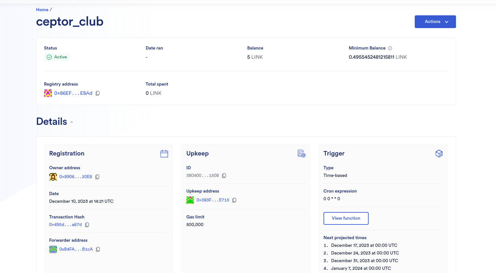
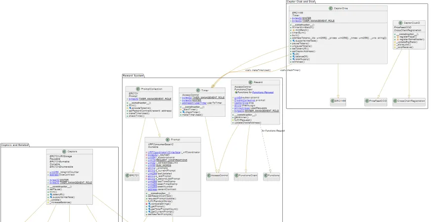
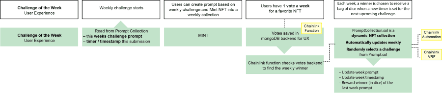

# Constellation of Smart Contracts

> Eman Herawy, Tippi Fifestarr, and Danjo the 0x all helped out with this
> 
> Jason A made the VRF D20 NFT
>
> Spencer made the LootSender and LootBox NFT.

## Overview

This is a constellation of smart contracts that work together to create a decentralized application. The contracts are written in Solidity and tested using the Framework of Hackathon Testing (FOHT).

"It is I, Tippi Fifestarr, Chainlink Developer Expert and one of the OG Founders of Ceptor Club. Hark, and "heart" our Tech Team's fantastic story!" -- Constellation, 2023


## Inspirational Project Story: Art, Tech, & Games

A year ago, at the Chainlink Fall 2022 hackathon, a spark was ignited in us at Ceptor Club to explore the synergy between art, tech, and games. We won a small prize, and then got a Filecoin Next Steps Grant.  Somya, Aire, Jason, Cromewar, Danjo and myself sprinted forward and then began a long campaign into the [Realm of the Slime Mold](https://komoroske.com/slime-mold/). Our journey, inspired by the vast potential of blockchain, AI, and immersive gaming experiences, attracted over 100 volunteers to sign up for [Onboarding](https://danj-o.notion.site/Onboarding-Log-6452861dbe9e4f26a507032fabc34791?pvs=4) and finding their First Mission. Chainlink Spring 2023 saw Team Leader Somya (mother of our Dragonborns) almost defeated in a wild battle with the Scope Creeper, but we emerged with our second win (Top Quality Prize).  Sean Domini took a stab at implementing **SocialFi** using Chainlink Automation and Functions, which inspired us to try again this time.  The Great Wizard Donzo built an amazing Quiz but it was in PHP, so we spent a couple months getting the quiz into our React app.  Donzo, if you are reading this, check out our redesign (see Ceptor Games Team) and come play a game! 


*Screenshot placeholder: Ceptor Club's journey over the last 6 months*


With Ceptor Club's growth, especially after [our workshop at ETHChicago](https://x.com/0xEthChicago/status/1702871801292824850?s=20) and sponsoring the [Cyberjam imnotHackathon](https://x.com/im_not_art/status/1721977236239143030?s=20), it became clear that our burgeoning community needed more structured teams and there were too many of us for just one team in the Chainlink Hackathon. 

Thus, Ceptor Tech (and The Three Teams) was born.  I reached out to my friend and fellow Chainlink Dev Expert Eman Herawy, and she suggested Lena (GigaHierz).  Aire, who was on the OG team way back in 2022 joined Team Tech soon after.  In the final weekend, we were joined by the Amy Shafe, our Executive Producer.  Our mission: to resurrect lost features, prototype a viable business model, and guide our sister teams (Ceptor Artour & Ceptor Games) in integrating Chainlink technology and our new and improved end-to-end user journey.  

*Ceptor Club Contributors Worldwide, and you can too! Art + Tech + Games*

# Main Contribution made during this hackathon
To help you know what we added during this hackathon, we have added a list of the main contributions made during this hackathon. These changes could be tracked in the code base as well. The below list is just to help you understand the main contributions made during this hackathon.
- [enhancements and changes to the existing codebase](https://github.com/ceptor-club/Ceptor-Tech/pull/5)
    - [x] Added a new contract `Reward.sol` to manage minting Dice NFTs for the most-liked POW NFT each week.
    - [x]  Timer Workflow Refactoring.
    - [x] Added a new contract `PromptCollection.sol` to let users to participate in the weekly prompt this contract extends `Prompt.sol`.
    - [x] Enhance the  code quality in `CeptorDice.sol`.
- [x] Enhance the  code quality in `Septors.sol`.
-  [x] Added a new contract `CeptorClubID.sol` to manage user registration, stats, and loot.

## Chainlink Hackathon Services Used
We are so honored tosay that we used most of the chainlink services in our project. We used the following services:
- [x] Chainlink VRF [check the code here](https://github.com/ceptor-club/Ceptor-Tech/blob/tech-dev/smart_contracts/src/Prompt.sol)
- [x] Chainlink Automation( run weekly)
    - One Automation to call to automate TWO Chainlink Services 
        - [x] Chainlink VRF 
        - [x] Chainlink Functions
        
- [x] Chainlink Functions[check the code here](https://github.com/ceptor-club/Ceptor-Tech/blob/tech-dev/smart_contracts/src/Reward.sol) and [here](https://github.com/ceptor-club/Ceptor-Tech/blob/tech-dev/smart_contracts/source.js) and you can check the function simulation [here](https://github.com/ceptor-club/Ceptor-Tech/blob/tech-dev/smart_contracts/simulate/request.js) 
- [x] Chainlink Price Feeds [check the code here](https://github.com/ceptor-club/Ceptor-Tech/blob/tech-dev/smart_contracts/src/ccid/PriceFeedCCID.sol)
- [x] Chainlink CCIP 
    - Our CCID is handling cross-chain calles from Game Chain to Art Chain [ two different networks] [check the code here](https://github.com/ceptor-club/Ceptor-Tech/blob/d2afb50f5e58470e56d8313a0534c72894492a81/smart_contracts/src/CeptorClubID.sol#L144)
### Contracts
big overview of contracts


1. **CeptorClubID.sol**
    Below is an overview of its functionality:

    - User Registration: Users can register a username with the registerUsername function, which requires a payment unless the sender is the contract owner.
    - Stats Management: The contract allows updating user stats through the updateBigStats function, which is restricted to the owner.
    - Loot Handling: It includes functionality to store and manage loot associated with users. Loot can be added to a user's account via the _ccipReceive function, which is designed to handle cross-chain messages.
    - Chain Interaction: The contract can check the blockchain it's deployed on with checkDeployedChain and handle cross-chain messages with _ccipReceive.
    - Access Control: There's a mechanism to approve or disapprove senders for cross-chain interaction using setApprovedSender.

    - [ ] Implement security checks to ensure that Loot and Stats are received from the correct contracts.
    - [ ] Consider adding a function to allow users to leave the system and retrieve a portion of their funds.
    - [ ] Review and possibly refactor the getRegistrationCost function as it's marked as "crap".
    - [ ] Address the question about whether CCIP libraries work with proxy contracts.
    - [ ] Determine the XP multiplier logic based on user levels.

    **Explanation of LootGetter.sol**

    LootGetter.sol is a contract that demonstrates how to receive string data across chains using Chainlink's Cross-Chain Interoperability Protocol (CCIP). It includes:

    - An event MessageReceived that logs the details of the received message.
    - A function _ccipReceive that handles the incoming CCIP message, decodes it, and stores the details in a LootMessage struct.
    - A function getLastReceivedMessageDetails that allows retrieval of the last received message's details.

    The contract is marked as an example and should not be used in production as it uses hardcoded values and un-audited code.
2. **Reward.sol** 
    - Manages minting Dice NFTs for the most-liked POW NFT each week.
    -  Consumes **Chainlink function** to call the API and retrieve winning NFT.
    -  Calls the Dice NFT contract to mint a bag of dice for the winner.
3. **Dice.sol**
    - Manages minting of Dice NFTs.
    -  timer per burning of dice.
4. **Ceptors.sol**
    - Manages minting of Ceptors NFTs.
    -  BurnTimer should be running for the Ceptors to be minted.
5. **PromptCollection.sol**
    - Manages minting of Prompt NFTs.
    - Manages the random weekly prompt
    -  call the `Reward.sol` to reward the weeek winner

**something amazing from Eman*: https://github.com/ceptor-club/Ceptor-Tech/blob/tech-dev/smart_contracts/script/Flow.sol
## General Flow 
Aire supported with our front-end CCID flow and provided last minute help and QA.


## Foundry

# CeptorClubID: A DAOist Poem

In the realm of **CeptorClubID**, where DAOs hold sway,
Blockchain whispers echo, in a decentralized ballet.
Smart contracts dance, with **Foundry** as the stage,
Solving problems, in the DAOist age.

In the silence of nodes, under the blockchain's light,
**CeptorClubID** works tirelessly, into the digital night.
With each transaction, a new story unfurls,
In this DAOist world, where imagination whirls.

From the chaos of data, order takes form,
In the heart of the network, **CeptorClubID** is warm.
Creating, solving, in the digital sea,
In the world of **CeptorClubID**, we are truly free.

So here's to **CeptorClubID**, where dreams come alive,
In the world of blockchain, we thrive.
**CeptorClubID**, we're the new sensation,
Welcome to the future of decentralization.

**Foundry is a blazing fast, portable and modular toolkit for Ethereum application development written in Rust.**

Foundry consists of:

-   **Forge**: Ethereum testing framework (like Truffle, Hardhat and DappTools).
-   **Cast**: Swiss army knife for interacting with EVM smart contracts, sending transactions and getting chain data.
-   **Anvil**: Local Ethereum node, akin to Ganache, Hardhat Network.
-   **Chisel**: Fast, utilitarian, and verbose solidity REPL.

## Documentation

https://book.getfoundry.sh/

## Usage

### Build

```shell
$ forge build
```

### Test

```shell
$ forge test
```

### Format

```shell
$ forge fmt
```

### Gas Snapshots

```shell
$ forge snapshot
```

### Anvil

```shell
$ anvil
```

### Deploy

```shell
$ forge script script/Counter.s.sol:CounterScript --rpc-url <your_rpc_url> --private-key <your_private_key>
```

### Cast

```shell
$ cast <subcommand>
```

### Help

```shell
$ forge --help
$ anvil --help
$ cast --help
```
forge verify-contract 0xEc2df342d40D46fae8407F24f078138ec6d77FbA  PromptCollection  --constructor-args $(cast abi-encode "constructor(address ,address,bytes32,uint64,uint32 callbackGasLimit)" 0x8103B0A8A00be2DDC778e6e7eaa21791Cd364625 0x45DB01904b51857F6279FE9006De25bf6dE8d136 0x474e34a077df58807dbe9c96d3c009b23b3c6d0cce433e59bbf5b34f823bc56c 7650 2500000 ) --watch   --chain-id  11155111


forge verify-contract 0xDA38118B32394748f7b720E5CBad719EfD02da0B  Ceptors  --constructor-args $(cast abi-encode "constructor(address)" 0x45DB01904b51857F6279FE9006De25bf6dE8d136 ) --watch   --chain-id  11155111
